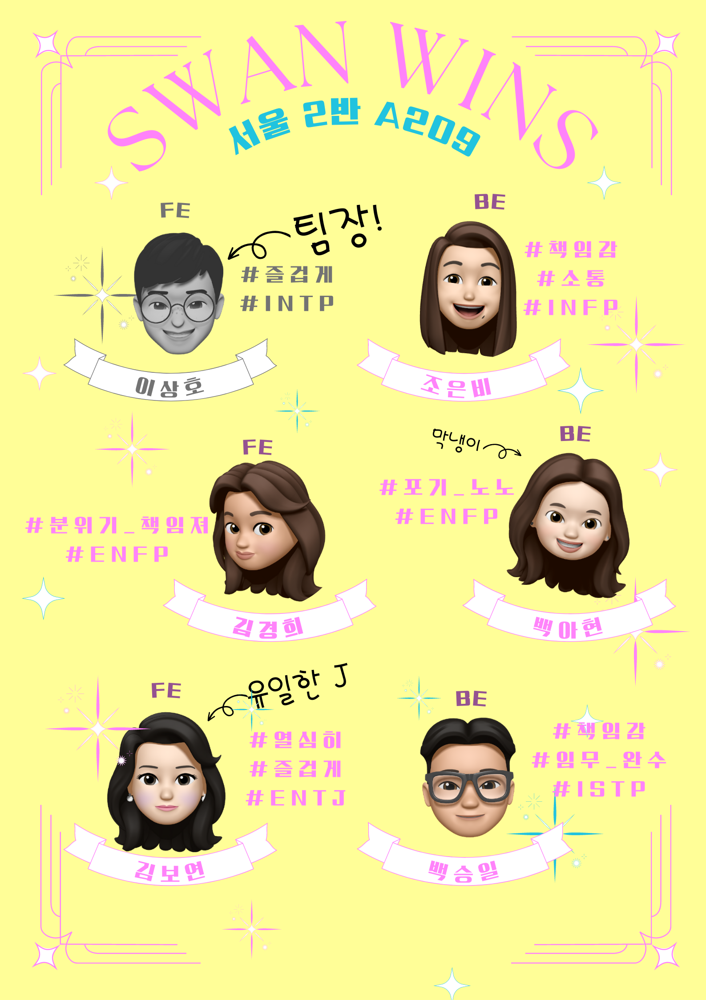

# Zucchini Market

## 👩‍💻👨‍💻 팀원 소개

팀원 : 김경희, 김보연, 백승일, 백아현, 이상호, 조은비



<br>
<br>

## 📅 프로젝트 기간

### 2023.07.04 ~ 2023.08.18 (6주)

- 기획 및 설계 : 2023.07.04 ~ 2023.07.12
- 프로젝트 구현 : 2023.07.13 ~ 2023.08.14
- 버그 수정 및 산출물 정리 : 2023.08.15 ~ 2023.08.17

<br>

<br>

## 💡 프로젝트 컨셉 및 주요 기능

### 애호박마켓

> **애** 타는 당신을 위한<br/> > **호** 구없는<br/> > **박** 박<br/> > **마**<br/> > **켓**

<br>

### 의도

- 사용자와 구매자 양측의 사기 방지 서비스를 제공하는 안전한 중고거래 서비스

<br>

### 예상 사용자

- 기존 중고 거래시 사진만으로는 상품에 대한 충분한 정보를 얻기 힘들었던 구매자
- 정상 작동되는 물품을 판매하였어도 구매자가 수령 이후 제품 문제 주장시 책임 소재를 가리기 어려웠던 판매자
- 집 근처가 아닌 전 지역을 대상으로 거래를 희망하는 사용자

<br>

### 주요 기능

- OpenVidu의 실시간 화상 통화(Web RTC)를 활용하여 정확한 상품 확인이 가능
- 거래 확정 후 1주 ~ 최대 2주간 화상통화내역 다시보기 기능 제공하여 당시 상품 상태 기록을 통해 사용자와 구매자 양측의 사기 방지 서비스 제공
- 캘린더를 활용한 구매자와 판매자 간 일정 조율 기능
- 실시간 채팅 기능을 이용하여 음성 대화가 어려울 경우에도 충분한 소통 가능

<br>

### 기대 효과

- 안전한 중고 거래
  - 실시간 영상 통화를 활용하여 정확한 상품 확인
  - 허위 매물 방지
  - 판매 당시 상품 상태 녹화
- 비대면 중고 거래
  - 직접 만나지 않아도 상품을 자세하게 확인 가능

<br>
<br>

## 🛠️ 기술스택

### front

    

### back

    

### DB

  

### CI/CD

   

### WebRTC


### 협업툴

    

<br>
<br>

## 🗃️ ERD


<br>

<br>

## 🎨 Figma


<br>

<br>

## 🗳️ API 명세서

[API 명세서 보러가기 (∩^o^)⊃━☆](./assets/api.pdf)

<br>
<br>

## 📂 프로젝트 구성

시스템 아키텍처

<br>

- FE 폴더 구조
  ```
  📁node_modules
  📁public
  📂src
  	ㄴ📂assets
  		ㄴ📁fonts
  		ㄴ📁images
  		ㄴ📁styles
  	ㄴ📂components
  		ㄴ📂Button
  			ㄴ📄ClosedButton.tsx
  			ㄴ📄FullWidthButton.tsx
  			ㄴ📄GoBackButton.tsx
  		ㄴ📂Chat
  			ㄴ📄Chatting.tsx
  			ㄴ📄LeftChat.tsx
  			ㄴ📄LiveChat.css
  			ㄴ📄LiveChat.js
  			ㄴ📄RightChat.tsx
  		ㄴ📂Common
  			ㄴ📄Button.tsx
  			ㄴ📄FileUpload.tsx
  			ㄴ📄GradeImage.tsx
  			ㄴ📄GradeText.tsx
  			ㄴ📄Icon.tsx
  			ㄴ📄Input.tsx
  			ㄴ📄Modal.tsx
  			ㄴ📄PrivateRoute.tsx
  			ㄴ📄Report.tsx
  		ㄴ📂Conference
  			ㄴ📄Conference.tsx
  			ㄴ📄ConferenceRoom.css
  			ㄴ📄ConferenceRoom.js
  		ㄴ📂dialog-extension
  			ㄴ📄DialogExtension.css
  			ㄴ📄DialogExtension.js
  		ㄴ📂Footer
  			ㄴ📄Footer.tsx
  			ㄴ📄Logo.tsx
  			ㄴ📄PrivacyPolicy.tsx
  			ㄴ📄TermsOfUse.tsx
  		ㄴ📂Form
  			ㄴ📄Form.tsx
  			ㄴ📄index.ts
  		ㄴ📂 Header
  			ㄴ📂components
  				ㄴ📄Menu.tsx
  				ㄴ📄MenuNavigation.tsx
  				ㄴ📄MenuWindow.tsx
  				ㄴ📄Navigation.tsx
  			ㄴ📂constants
  				ㄴ📄loggedOutNavigation.ts
  				ㄴ📄menuNavigation.ts
  				ㄴ📄navigation.ts
  			ㄴ📄Header.tsx
  			ㄴ📄index.ts
  		ㄴ📂List
  			ㄴ📄Category.tsx
  			ㄴ📄CategorySecond.tsx
  			ㄴ📄ChatRoomEach.tsx
  			ㄴ📄ItemEach.tsx
  			ㄴ📄ItemEachMini.tsx
  			ㄴ📄MessageEach.tsx
  			ㄴ📄Search.tsx
  		ㄴ📂Loading
  			ㄴ📄Loading.tsx
  		ㄴ📂Schedule
  			ㄴ📄ScheduleEach.tsx
  			ㄴ📄SelectedTime.tsx
  			ㄴ📄SelectedTimes.tsx
  			ㄴ📄SimpleCalendar.tsx
  			ㄴ📄SimpleCalendarDesign.css
  			ㄴ📄SimpleCalendarRegister.tsx
  		ㄴ📂stream
  			ㄴ📄OvVideo.js
  			ㄴ📄StreamComponent.css
  			ㄴ📄StreamComponent.js
  		ㄴ📂toolbar
  			ㄴ📄ToolbarComponent.css
  			ㄴ📄ToolbarComponent.js
  			ㄴ📄ToolbarComponent.tsx
  	ㄴ📂constants
  		ㄴ📄color.ts
  		ㄴ📄localStorageKey.ts
  		ㄴ📄queryKey.ts
  		ㄴ📄ScrollToTop.ts
  		ㄴ📄url.ts
  	ㄴ📂fileUpload
  		ㄴ📄DragDrop.tsx
  	ㄴ📂hooks
  		ㄴ📄useAuth.ts
  		ㄴ📄useLoading.ts
  		ㄴ📄useLocalStorage.ts
  		ㄴ📄useLogin.ts
  		ㄴ📄useUserInfo.ts
  	ㄴ📂layout
  		ㄴ📄openvidu-layout.js
  	ㄴ📂models
  		ㄴ📄user-model.js
  	ㄴ📂pages
  		ㄴ📄AboutConference.tsx
  		ㄴ📄AboutReplay.tsx
  		ㄴ📄AboutSchedule.tsx
  		ㄴ📄BuyList.tsx
  		ㄴ📄ChatList.tsx
  		ㄴ📄ChatRoom.tsx
  		ㄴ📄CreateItem.tsx
  		ㄴ📄ItemDetail.tsx
  		ㄴ📄ItemList.tsx
  		ㄴ📄LikeList.tsx
  		ㄴ📄Login.tsx
  		ㄴ📄Main.tsx
  		ㄴ📄MyPage.tsx
  		ㄴ📄NotFound.tsx
  		ㄴ📄ReplayBuyVideo.tsx
  		ㄴ📄ReplaySellVideo.tsx
  		ㄴ📄ScheduleList.tsx
  		ㄴ📄SellList.tsx
  		ㄴ📄SignUp.tsx
  		ㄴ📄SignUpAgreement.tsx
  		ㄴ📄UpdateItem.tsx
  		ㄴ📄UpdatePassword.tsx
  		ㄴ📄UpdateUser.tsx
  		ㄴ📄UserPage.tsx
  	ㄴ📂types
  		ㄴ📄IFileTypes.ts
  		ㄴ📄image.d.ts
  		ㄴ📄Imessage.ts
  		ㄴ📄IToken.ts
  	ㄴ📂utils
  		ㄴ📄api.ts
  		ㄴ📄axios.ts
  	ㄴ📄GlobalStyles.tsx
  	ㄴ📄index.tsx
  	ㄴ📄Root.tsx
  	ㄴ📄router.tsx
  	ㄴ📄setupProxy.js
  🐳Dockerfile
  ⚙️nginx.conf
  ```
- BE 폴더 구조
  ```
  📁.gradle
  📁.idea
  📁build
  📁gradle
  📂src
  	ㄴ📂main
  		ㄴ📂java
  			ㄴ📂com.zucchini
  				ㄴ📂domain
  					ㄴ📂category
  						ㄴ📂domain
  							ㄴ📄Category
  							ㄴ📄ItemCategory
  							ㄴ📄ItemCategoryId
  						ㄴ📂dto.response
  							ㄴ📄FindCategoryResponse
  						ㄴ📂repository
  							ㄴ📄CategoryRepository
  							ㄴ📄ItemCategoryRepository
  							ㄴ📄ItemCategoryRepositoryCustom
  							ㄴ📄ItemCategoryRepositoryImpl
  						ㄴ📂service
  							ㄴ📄CategoryService
  							ㄴ📄CategoryServiceImpl
  					ㄴ📂conference
  						ㄴ📂api
  							ㄴ📄ConferenceController
  						ㄴ📂domain
  							ㄴ📄Conference
  						ㄴ📂dto
  							ㄴ📄FindConferenceResponse
  							ㄴ📄FindItemUserResponse
  						ㄴ📂repository
  							ㄴ📄ConferenceRepository
  						ㄴ📂service
  							ㄴ📄ConferenceService
  							ㄴ📄ConferenceServiceImpl
  					ㄴ📂grade
  						ㄴ📂api
  							ㄴ📄GradeController
  						ㄴ📂domain
  							ㄴ📄Grade
  						ㄴ📂dto.request
  							ㄴ📄GiveGradeRequest
  						ㄴ📂repository
  							ㄴ📄GradeRepository
  						ㄴ📂service
  							ㄴ📄GradeService
  							ㄴ📄GradeServiceImpl
  					ㄴ📂image
  						ㄴ📂domain
  							ㄴ📄Image
  						ㄴ📂repository
  							ㄴ📄ImageRepository
  						ㄴ📂service
  							ㄴ📄ImageService
  							ㄴ📄ImageServiceImpl
  					ㄴ📂item
  						ㄴ📂api
  							ㄴ📄ItemController
  						ㄴ📂domain
  							ㄴ📄Item
  							ㄴ📄ItemDate
  						ㄴ📂dto
  							ㄴ📂request
  								ㄴ📄AddItemRequest
  								ㄴ📄ModifyItemRequest
  							ㄴ📂response
  								ㄴ📄DateResponse
  								ㄴ📄FindItemResponse
  								ㄴ📄FindItemResponse
  						ㄴ📂repository
  							ㄴ📄ItemDateRepository
  							ㄴ📄ItemRepository
  							ㄴ📄ItemRepositoryCustom
  							ㄴ📄ItemRepositoryImpl
  						ㄴ📂service
  							ㄴ📄ItemService
  							ㄴ📄ItemServiceImpl
  					ㄴ📂realtimechat
  						ㄴ📄WebSocketController
  					ㄴ📂report
  						ㄴ📂api
  							ㄴ📄ReportController
  						ㄴ📂domain
  							ㄴ📄Report
  						ㄴ📂dto
  							ㄴ📄AddReportRequest
  						ㄴ📂repository
  							ㄴ📄ReportRepository
  						ㄴ📂service
  							ㄴ📄ReportService
  							ㄴ📄ReportServiceImpl
  					ㄴ📂reservation
  						ㄴ📂api
  							ㄴ📄ReservationController
  						ㄴ📂domain
  							ㄴ📄Reservation
  						ㄴ📂dto
  							ㄴ📂request
  								ㄴ📄ConfirmReservationRequest
  								ㄴ📄ReservationRequest
  							ㄴ📂response
  								ㄴ📄CheckReservationResponse
  								ㄴ📄ReservationResponse
  						ㄴ📂repository
  							ㄴ📄ReservationRepository
  						ㄴ📂service
  							ㄴ📄ReservationService
  							ㄴ📄ReservationServiceImpl
  					ㄴ📂room
  						****ㄴ📂api
  							ㄴ📄RoomController
  						ㄴ📂domain
  							ㄴ📄Message
  							ㄴ📄Room
  							ㄴ📄RoomUser
  						ㄴ📂dto
  							ㄴ📄AddMessageRequest
  							ㄴ📄AddRoomRequest
  							ㄴ📄MessageResponse
  							ㄴ📄RoomItemResponse
  							ㄴ📄RoomResponse
  							ㄴ📄RoomUserResponse
  						ㄴ📂repository
  							ㄴ📄MessageRepository
  							ㄴ📄RoomRepository
  							ㄴ📄RoomRepositoryCustom
  							ㄴ📄RoomRepositoryImpl
  							ㄴ📄RoomUserRepository
  						ㄴ📂service
  							ㄴ📄RoomService
  							ㄴ📄RoomServiceImpl
  					ㄴ📂session
  						ㄴ📂api
  							ㄴ📄SessionController
  						ㄴ📂dto
  							ㄴ📂request
  								ㄴ📄LeaveSessionRequest
  							ㄴ📂response
  								ㄴ📄FindSessionResponse
  								ㄴ📄LeaveSessionResponse
  								ㄴ📄StopRecordingResponse
  						ㄴ📂service
  							ㄴ📄SessionService
  							ㄴ📄SessionServiceImpl
  					ㄴ📂sse
  						ㄴ📂api
  							ㄴ📄SseController
  						ㄴ📂dto
  							ㄴ📄BuyAlertDto
  						ㄴ📂emitter
  							ㄴ📄SseEmitters
  					ㄴ📂user
  						ㄴ📂api
  							ㄴ📄UserController
  						ㄴ📂domain
  							ㄴ📄User
  							ㄴ📄UserItemLike
  							ㄴ📄UserItemLikeId
  						ㄴ📂dto
  							ㄴ📂request
  								ㄴ📄AddUserRequest
  								ㄴ📄EmailCheckRequest
  								ㄴ📄EmailRequest
  								ㄴ📄LoginRequest
  								ㄴ📄ModifyPasswordRequest
  								ㄴ📄ModifyUserRequest
  							ㄴ📂response
  								ㄴ📄FindUserResponse
  								ㄴ📄UserInfoResponse
  						ㄴ📂repository
  							ㄴ📄UserItemLikeRepository
  							ㄴ📄UserItemLikeRepositoryCustom
  							ㄴ📄UserItemLikeRepositoryImpl
  							ㄴ📄UserRepository
  							****ㄴ📄UserRepositoryCustom
  							ㄴ📄UserRepositoryImpl
  						ㄴ📂service
  							ㄴ📄UserService
  							ㄴ📄UserServiceImpl
  					ㄴ📂video
  						ㄴ📂api
  							ㄴ📄VideoController
  						ㄴ📂domain
  							ㄴ📄Video
  						ㄴ📂dto
  							ㄴ📂request
  								ㄴ📄AddVideoRequest
  								ㄴ📄ModifyVideoRequest
  							ㄴ📂response
  								ㄴ📄FindVideoResponse
  						ㄴ📂repository
  							ㄴ📄VideoRepository
  						ㄴ📂service
  							ㄴ📄VideoServiceImpl
  							ㄴ📄VideoServiceImpl
  				ㄴ📂global
  					ㄴ📂common
  						ㄴ📄PageResponse
  						ㄴ📄PageSizeEnums
  					ㄴ📂config
  						ㄴ📂cache
  							ㄴ📄CacheConfig
  							ㄴ📄CacheKey
  						ㄴ📂jwt
  							ㄴ📄JwtAuthenticationFilter
  							ㄴ📄JwtEntryPoint
  							ㄴ📄JwtExpirationEnums
  							ㄴ📄JwtHeaderUtilEnums
  							ㄴ📄WebSocketInterceptor
  						ㄴ📂security
  							ㄴ📄CustomUserDetails
  							ㄴ📄CustomUserDetailService
  							ㄴ📄SecurityConfig
  						ㄴ📄FilterChannelInterceptor.java
  						ㄴ📄QuerydslConfig
  						ㄴ📄WebConfig
  						ㄴ📄WebSocketConfig
  					ㄴ📂domain
  						ㄴ📄LogoutAccessToken
  						ㄴ📄LogoutAccessTokenRedisRepository
  						ㄴ📄RefreshToken
  						ㄴ📄RefreshTokenRedisRepository
  						ㄴ📄ReservationConfirmCode
  						ㄴ📄ReservationConfirmCodeRepository
  						ㄴ📄TokenDto
  					ㄴ📂exception
  						ㄴ📄GlobalExceptionHandler
  						ㄴ📄NotValidException
  						ㄴ📄UserException
  					ㄴ📂util
  						ㄴ📄JwtTokenUtil
  						ㄴ📄RedisUtil
  				ㄴ📄ZucchiniBackApplication
  		ㄴ📂resources
  			ㄴ📄application.yml
  	ㄴ📂test
  		ㄴ📂java
  			ㄴ📂com.zucchini.zucchini_back
  				ㄴ📄ZucchiniBackApplicationTests
  🐳Dockerfile
  ```

<br>
<br>

## 📌 시연 시나리오

[애호박 마켓의 시연 보러가기 (☞ ﾟヮﾟ)☞](./assets/시연영상.mp4)

<br>
<br>

## 🎥 UCC

[애호박 마켓의 UCC 보러가기 ヾ(⌐■_■)ノ ♪](./assets/애호박마켓.mp4)

<br>
<br>

## 📊 PPT 발표 자료

- 중간 발표 : [중간 발표 ppt자료 보러가기 (∩^o^)⊃━☆](./assets/firstppt.pptx)
- 최종 발표 : [최종 발표 ppt자료 보러가기 (∩^o^)⊃━☆](./assets/finalppt.pdf)
